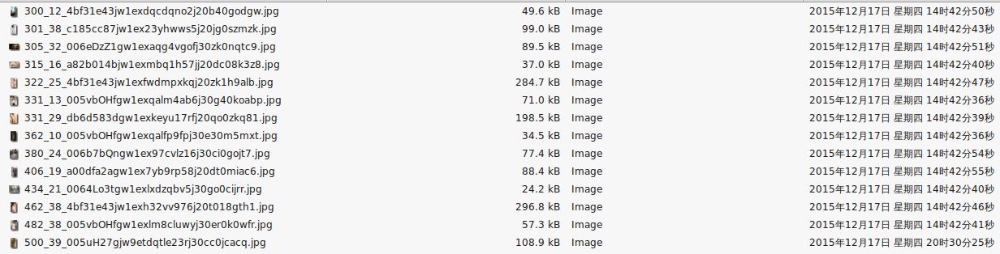

##We love Jandan !!!!.... 's meizitu..
抓取高质量煎蛋meizi图, oo数大于500的(你可以自己设).
##需要的库
```
BeautifulSoup
mechanize
```
##使用
会自动在当前目录创建两个文件夹,一个meizitu存放图片,一个htmls存放html.
```
python jandanMeizi.py
```
##防被封
我也不知道咋整,所以每隔2秒请求一个煎蛋页面.
##使用效果
```python
http://jandan.net/ooxx/page-1189
Downloading: 506_60_921f8a8cgw1ejd8tnz8mhj20c80icmxx.jpg Bytes: 38576
      38576  [100.00%]
Downloading: 602_88_df43c939jw1ejb0dmhj5dj20go0m8jsj.jpg Bytes: 52869
      52869  [100.00%]
Downloading: 976_95_4e093a49tw1eja7holvepj20y80tojye.jpg Bytes: 192369
     192369  [100.00%]
Downloading: 565_1062_83dc76a0gw1ej9y56ov7gj20t813hahf.jpg Bytes: 251881
     251881  [100.00%]
http://jandan.net/ooxx/page-1188
Downloading: 701_78_56682a80gw1ej9ifhx9q0j20fr0oytag.jpg Bytes: 74594
      74594  [100.00%]
Downloading: 515_44_60446717jw9ej94dof3mzj20b40gomzy.jpg Bytes: 113292
     113292  [100.00%]
Downloading: 530_164_629cca26gw1ej6xzqr0rog20a00dce82.gif Bytes: 2507274
    2507274  [100.00%]
http://jandan.net/ooxx/page-1187
```
###真实效果(咳咳..)

##main, jandanMeizi.py
煎蛋关闭了太过久远的页面,比如我扒的时候,900页以下就找不到了.
```python
if __name__ == '__main__':
    
    if not os.path.isdir("meizitu"):
        os.mkdir("meizitu")    
    if not os.path.isdir("htmls"):
        os.mkdir("meizitu") 
        
    jandan_crawler = jandanCrawler()        
    my_meizi = jandan_meizi('meizitu')

##start是开始页面
##end是终止页面, 目前900以下的页面失效了
    base_url = 'http://jandan.net/ooxx/page-'
    start = 1650
    end = 1601
    for page in range(start, end-1, -1):
        time.sleep(2)    
        url =  base_url + str(page)
        print url
        try:
            html = jandan_crawler.getHtml(url)
            ## if you want to keep the html for furthur crawling
            ## 默认oo数是500以上,所以扒到的图片很少,浪费啊..所以把html也顺带存下载,丧心病狂的你可以再次抓取..
            with open(os.path.join('htmls', str(page)+'.html'), 'wb') as f:
                f.write(html)
            my_meizi.findMeizi(html, oo=500)                
        except mechanize.HTTPError as e:
            print "错误"
            error_code = e.getcode()
            if int(error_code) == 404:
                print error_code
                print "网址错了,试试网页还能打开不?"
            else:
                print error_code
                print "换个user agent试试"
        

```
##无聊图
无聊图和meizitu一样,把baseurl换成无聊图的就可以,在jandanWow.py